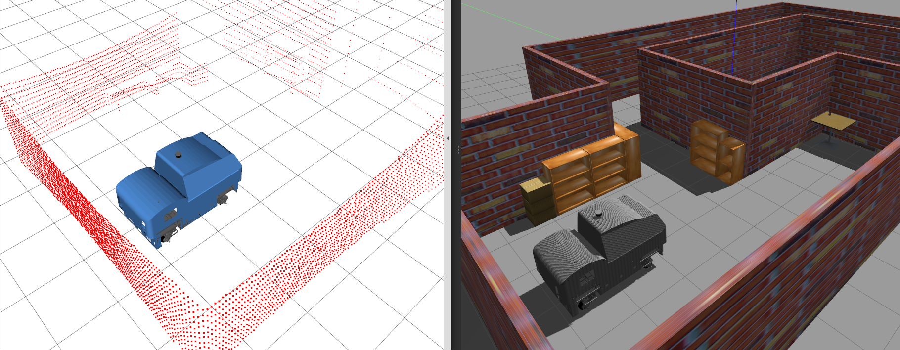

# Panthera Gazebo Simulation

ROS packages for simulating Panthera robot using Gazebo Simulator. We provides several environment worlds to test the robot. ROS controller for Panthera can be found in this [repository](https://github.com/roarLab/panthera_controller).

## Dependencies

Make sure you have ROS noetic installed, although other ros-distros might also work. This simualtion package also relies on the following external packages, so make sure you have installed everything from source before building this package.

- [panthera_msgs](https://github.com/roarLab/panthera_msgs)
- [panthera_controller](https://github.com/roarLab/panthera_controller)

## Build from source

```
cd <ros1_ws>/src
git clone https://github.com/roarLab/panthera_simulations
cd ..
rosdep install -y --from-paths src --ignore-src --rosdistro <YOUR_ROS_DISTRO>
catkin_make
```

## Simulate panthera in empty world

```
cd <ros1_ws>
source devel/setup.bash
roslaunch panthera_gazebo panthera_empty_world.launch
```

## Simulate panthera in hallway-like environment

```
cd <ros1_ws>
source devel/setup.bash
roslaunch panthera_gazebo panthera_hallway_world.launch
```

## Simulate panthera in town/city world (Not tested yet)

```
cd <ros1_ws>
source devel/setup.bash
roslaunch panthera_gazebo panthera_town_world.launch
```
