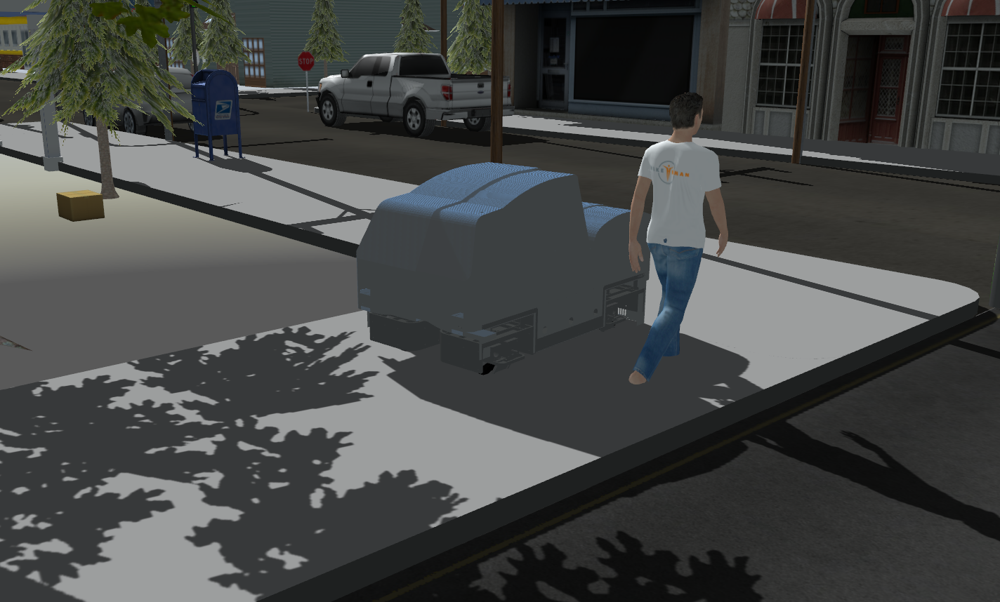

# Panthera Gazebo Simulation

ROS packages for simulating Panthera robot in a city-like environment using Gazebo Simulator. ROS controller for Panthera can be found in this [repository](https://github.com/roarLab/panthera_controller).

## Dependencies

- ROS noetic (tested), although other ros-distros might also work
- [panthera_controller](https://github.com/roarLab/panthera_controller)

## Build from source

```
cd <ros1_ws>/src
git clone https://github.com/roarLab/panthera_simulations
cd ..
catkin_make
```

## Running rviz visualization only

```
cd <ros1_ws>
source devel/setup.bash
roslaunch panthera_description panthera_rviz_visualization.launch
```

## Simulate panthera in empty world

```
cd <ros1_ws>
source devel/setup.bash
roslaunch panthera_gazebo panthera_empty_world.launch
```

## Simulate panthera in town/city world

```
cd <ros1_ws>
source devel/setup.bash
roslaunch panthera_gazebo panthera_town_world.launch
```